# XAI-Driven Sugarcane Leaf Disease Detection

An explainable deep learning framework for **accurate and interpretable sugarcane leaf disease classification** using EfficientNet-B0, MobileNetV2, and ResNet50, integrated with Grad-CAM visualizations and real-time deployment interfaces.

---

## Overview

This project presents a robust pipeline for **plant disease detection in precision agriculture**, combining:

- Deep Learning (CNNs)
- Explainable AI (Grad-CAM)
- Data Augmentation for class balancing
- Real-time deployment (Desktop + Mobile UI)

---

## Key Features

- Multi-model comparison (EfficientNet-B0, MobileNetV2, ResNet50)
- Explainability using Grad-CAM
- Balanced dataset using augmentation techniques
- High accuracy (~97%+ across all models)
- Desktop (Tkinter) + Mobile (Kivy) applications
- Client-server architecture for real-time inference

---

## Dataset

- **Total Images:** 6,748
- **Classes:** 12
  - 9 Disease Classes
  - Healthy Leaves
  - Dried Leaves
  - Custom **Insect Damage** class

### Dataset Improvements
- Removed mislabeled Pokkah Boeng samples
- Created new **Insect Damage** class
- Cleaned noisy data

---

## Methodology

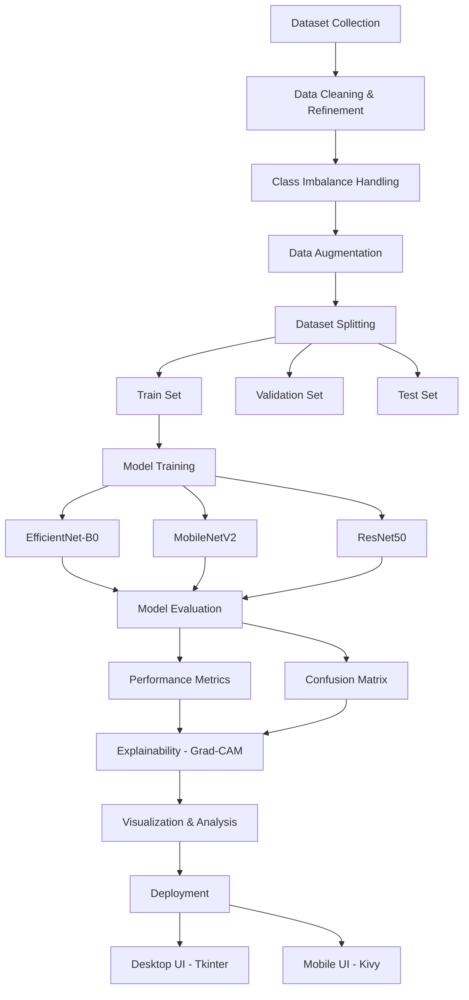

---

## Data Preprocessing & Augmentation

To handle class imbalance and improve generalization:

- Random Horizontal Flip
- Brightness Adjustment
- Contrast Variation
- Saturation Changes
- 90° Rotations

### Dataset split
- Train: 70%
- Validation: 20%
- Test: 10%

---

## Dataset Distribution

### Before Balancing


### After Balancing


---

## Model Architectures

| Model | Parameters | Key Strength |
|------|----------|-------------|
| EfficientNet-B0 | ~5.3M | Best accuracy & efficiency |
| MobileNetV2 | ~3.4M | Lightweight, mobile-friendly |
| ResNet50 | ~25.6M | Deep feature learning |

---

## Training Configuration

- Pretrained: ImageNet
- Optimizer: AdamW
- LR: 3e-4
- Scheduler: Cosine Annealing Warm Restarts
- Loss: Cross-Entropy (Label smoothing = 0.1)
- Epochs: 50
- Early Stopping: Patience = 8
- Mixed Precision Training (AMP)

---

## Training Performance

### Training & Validation Curves

| Metrics | EfficientNet-B0 | MobileNetV2 | ResNet50 |
|---------|-----------------|-------------|----------|
| Accuracy |  | 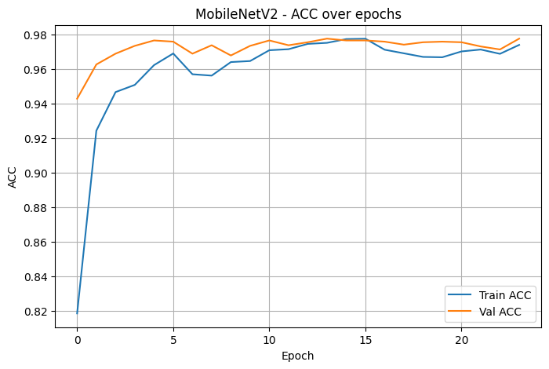 | 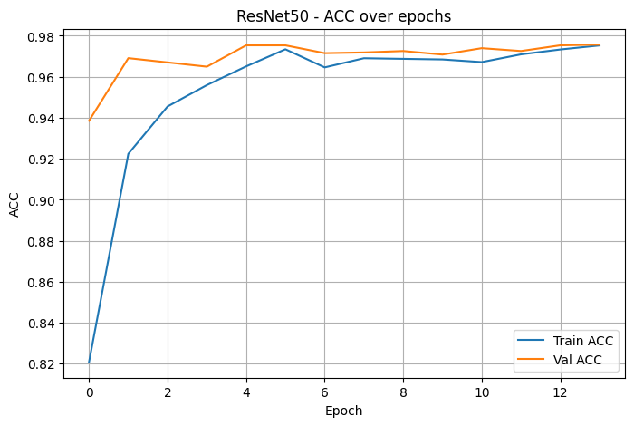 |
| Loss | 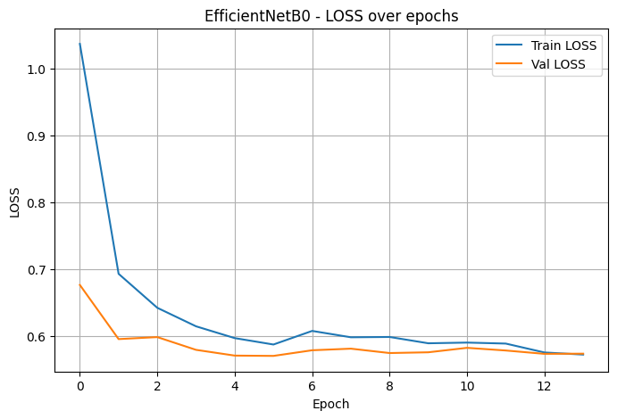 | 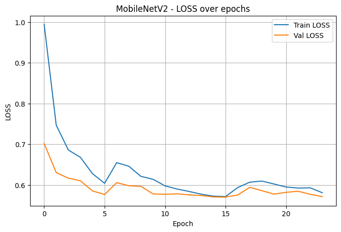 | 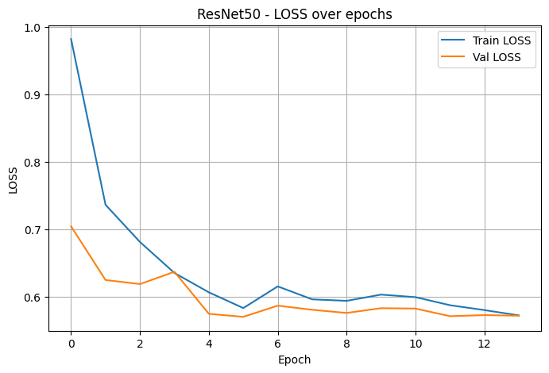 |
| Precision | 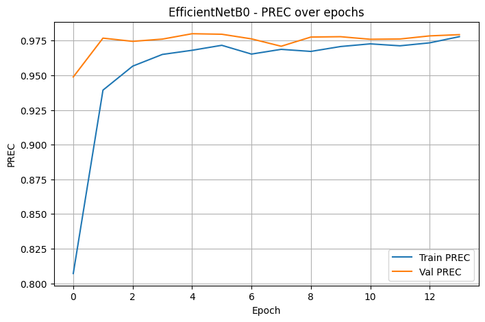 | 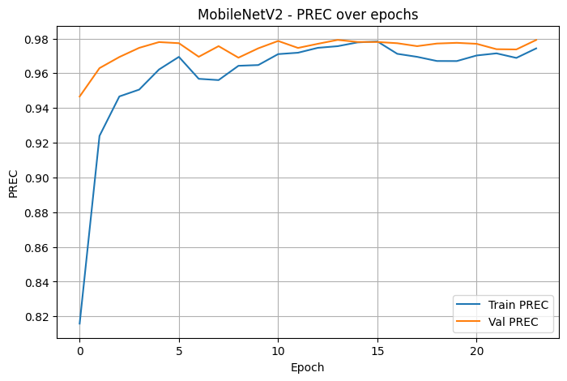 | 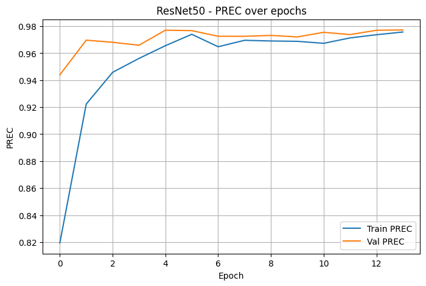 |
| Recall | 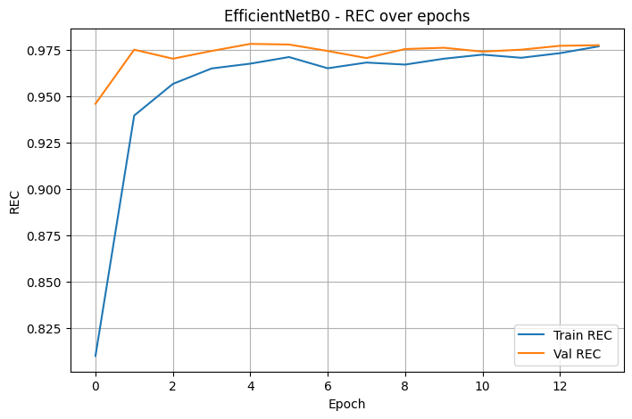 | 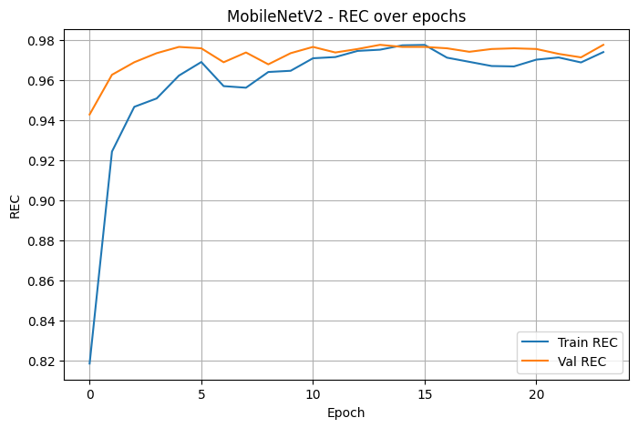 | 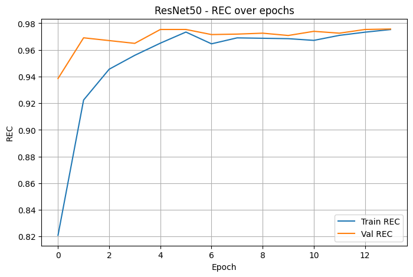 |
| F1-Score | 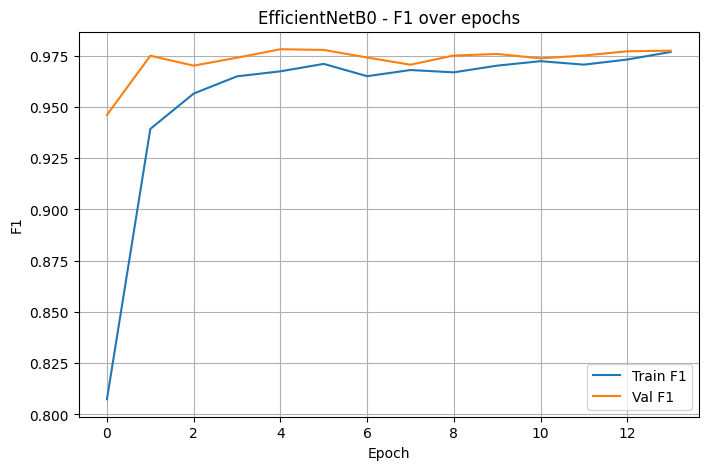 | 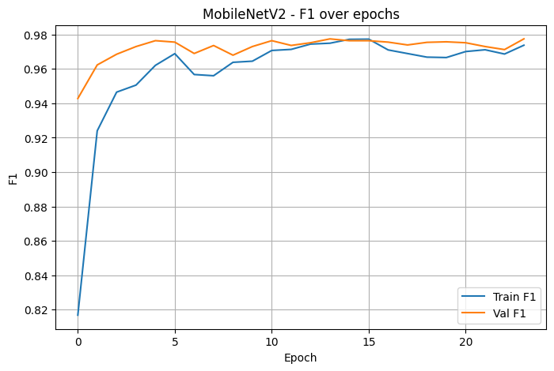 |  |

---

## Model Performance Comparison

### Bar Plots (Train / Validation / Test)
| EfficientNet-B0 | MobileNetV2 | ResNet50 |
|-----------------|-------------|----------|
| 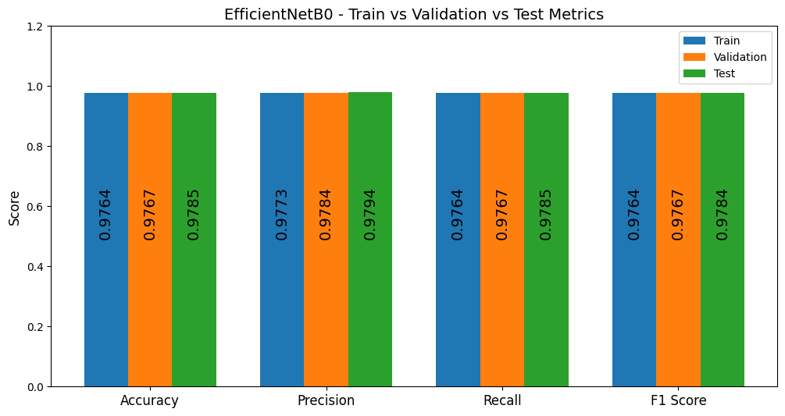 | 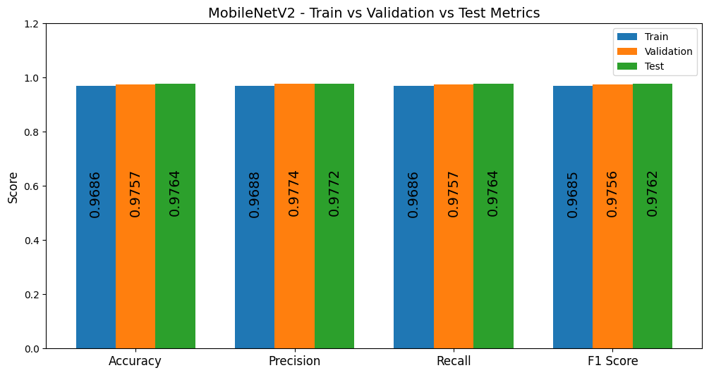 | 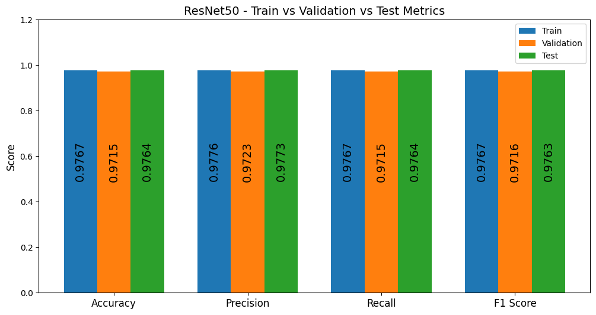 |

---

## Confusion Matrix


---

## Explainability (Grad-CAM)

Model focuses on **disease-relevant regions** instead of background noise.


---

## Results Summary

| Model | Accuracy | F1 Score |
|------|--------|---------|
| EfficientNet-B0 | **97.85%** | **97.84%** |
| MobileNetV2 | 97.64% | 97.62% |
| ResNet50 | 97.64% | 97.63% |

---

## Client-Server Architecture

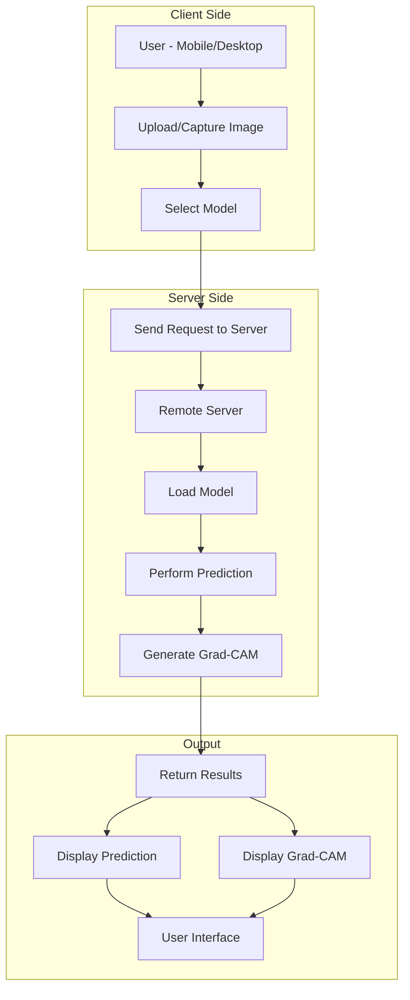

---

## User Interface (Demo/Preview)

### Desktop Application (Tkinter)

**Home Screen**
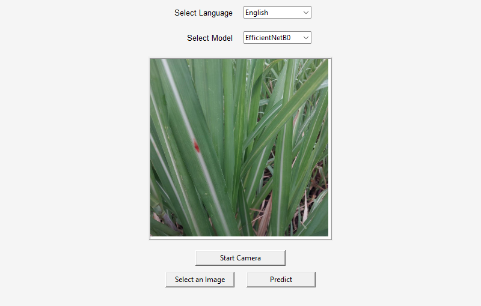

**Result Screen**
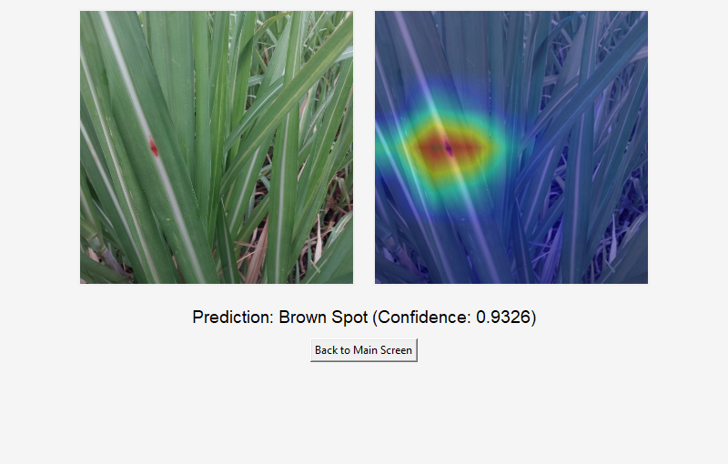

---

### Mobile Application (Kivy)

**Home Screen**
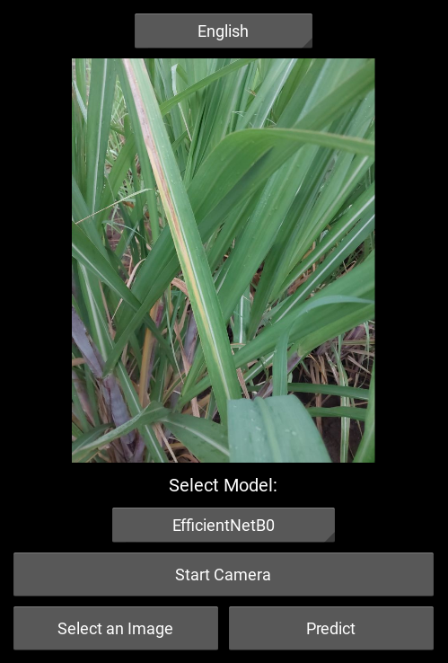

**Result Screen**
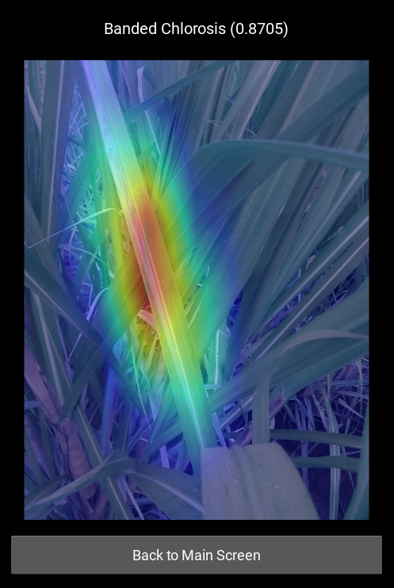

---

## System Architecture

- Client captures/uploads image
- Sends request to remote server
- Server:
  - Performs prediction
  - Generates Grad-CAM
- Returns result to UI

---

## How to Run

### 1. Start Server
```bash
python server.py
```

### 2. Run Desktop App
```
python desktop_app.py
```

### 3. Run Mobile App
```
python main.py
```

---

## Important Notes

- Server must be running before using applications
- Models are loaded from the backend server
- Ensure correct environment setup

---

## Applications
- Precision Agriculture
- Smart Farming Systems
- Disease Monitoring Tools
- Mobile-based Crop Diagnosis

---

## Conclusion

This project demonstrates that lightweight deep learning models combined with XAI can deliver:

- High accuracy
- Real-time performance
- Interpretability

making it suitable for real-world agricultural deployment.

---

## Tech Stack

- **Languages:** Python  
- **Deep Learning:** PyTorch, Torchvision  
- **Models:** EfficientNet-B0, MobileNetV2, ResNet50  
- **XAI:** Grad-CAM  
- **Data Processing:** NumPy, Pandas, OpenCV  
- **Visualization:** Matplotlib, Seaborn  
- **Deployment:** Tkinter (Desktop), Kivy (Mobile)  
- **Backend:** Client-Server Architecture  
- **Hardware:** NVIDIA GPU (CUDA), Mixed Precision Training

---

## License

This project is licensed under the MIT License.

---